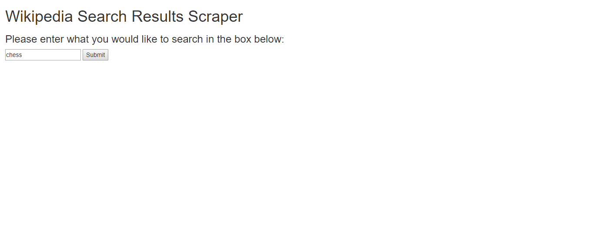
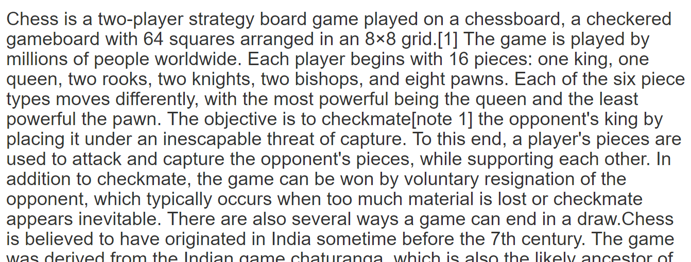

# Entry Eight:

In this week, I built and finished my MVP. I hope to put some finishing touches before presentations start.

## A Simple Program

To start off, I updated all of my code to match my current idea. For my MVP, I just want the user to give an input, and make the program return the content of the Wikipedia page that the user wants to search. 

In my `model.rb` I used the variable `scraper_results` to store the XML elements of the page and `scraper_results.css("p").text` to store the content of the page. For the rest of the code, I referred back to my Sinatra project. 

After all of that, I entered in the word "chess", and the program returned the entire **content** (not images or any headings) of the Wikipedia page of Chess. I also check the actual article to make sure, and it was true. I finally had my MVP finished, but not without some challenges along the way. 

## Challenges

One challenge I had was trying to get my Nokogiri gem to work without the program giving me an error. I commented out `require 'nokogiri'` at the top of my `model.rb` file, and the `index.erb` successfully loaded. I realized that Nokogiri was the problem, but I didn't know how to fix it. I need Nokogiri in order to make my program work. I tried typing `bundle install` and `gem install nokogiri` in my terminal, but none of those worked. After some googling, I found out that the `Gemfile` in my program didn't have the Nokogiri gem in it. After adding the gem and doing `bundle install`, I got the first page to load.

Another challenge I had was making my program work without using a url. What I mean is that the user only needs to type the word of the Wikipedia page, not the whole url of that page. All of the pages had `https://en.wikipedia.org/wiki/` followed by the specific thing the user searched for. In my `application_controller.rb`, I tried `@scrape_results = scrape_wiki_results(https://en.wikipedia.org/wiki/ + wiki_search)` but that didn't work. I also tried using string interpolation but that also failed. After more googling, I eventually found my solution. I just needed quotes around `https://en.wikipedia.org/wiki/`. I first thought this wouldn't work because when I first tried using the url of a specific page, it didn't need quotes. However, using quotes did in fact make my code work.

## Next Steps (For my App)

While my app works, it's only an **MVP**, meaning there are some things that can be worked on. For example, the result page of my app is just a huge block of text from the scraped page, which doesn't seem appealing at all. Another thing is when someone searches for something with multiple words, like "board game" they would have to enter "board_ game" in the scraper. This is because the url of Wikipedia pages with multiple words have an underscore (_) in-between each word. I hope to fix some of my problems before the presentation, but as long as the app works, I have an MVP.

## Takeaways

1. *Don't give up on your problem.* If your code doesn't work, just google the problem, or ask someone for help.
2. *Done is better than perfect.* I may have finished building my MVP, but it's far from perfect, but I am okay with that. 