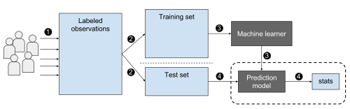

# Entry One:

In this week, I have explored many topics, and I liked many of them. I was especially interested in Machine learning and Web scraping. *However*, the topic I chose to learn in the end was Machine learning. Below is an explanation of what Web scraping is and why I chose not learn about it. While my choice may be subject to change, for now I will dive deep and continue to explore to see what Machine learning is all about.

## Why not Web Scraping?
**Web scraping** is obtaining data from a website's HTML and storing the code in a database. This technique is used to compile data that is not already together in the internet. While web scraping may seem simple enough, accuracy is extremely important as the programmer needs to locate the data that they want in the HTML. I briefly looked at [this reading](https://github.com/learn-co-students/scraping-reading-001) from the Flatiron School and thought that this was a nice topic to learn about. Also, web scraping runs on ruby. In the end though, I chose Machine learning because the topic interests me more. Perhaps I could study both topics if I have the time and know how to use them both together.

## What is Machine learning?

**Machine learning**, as its name suggests, lets a computer learn on its own using data without the computer needing specific code to do so. Machine learning has many uses in today's world, like recommending videos/movies online and self-driving cars.

To give an example of machine learning, lets say a person needs to sort different handwriting styles of the English alphabet by letter. A human can easily do that task because even though each handwriting has a different variation of the same letter (some letters are big or slanted), each letter generally follows a similar shape. In contrast, a computer program would have a more difficult time interpreting each letter as it could only see one type of letter (recognize only big letters but not slanted letters). Using machine learning, the computer could take in a large sample of sorted handwritten letters and enable it to sort an array of different handwriting styles. The bigger the sample, the more accurate the recognition is. 

In machine learning, there are two main algorithms: **supervised learning** and **unsupervised learning**

Going back to the previous example, supervised learning is being used because the large sample of sorted handwritten letters, or the **training data**, is given to the program, which lets the program be able to interpret future handwritten letters. In general, supervised learning means giving example data to the computer program and telling it to do the same thing based on what the program has been given. 

On the other hand, unsupervised learning means giving data to the computer program without having the training data to help. This is useful as sometimes the programmer doesn't know what patterns there are in the data.

## Takeaways

1. Google is one of the best resources out there. **Use it!** I found a lot of information about my topic just by doing a little research.
2. Make sure you know what you're getting yourself into when you choose your topic. You never know if you like it or not until you explore.
3. Giving an example of a long explanation can really help the reader understand what is being written.