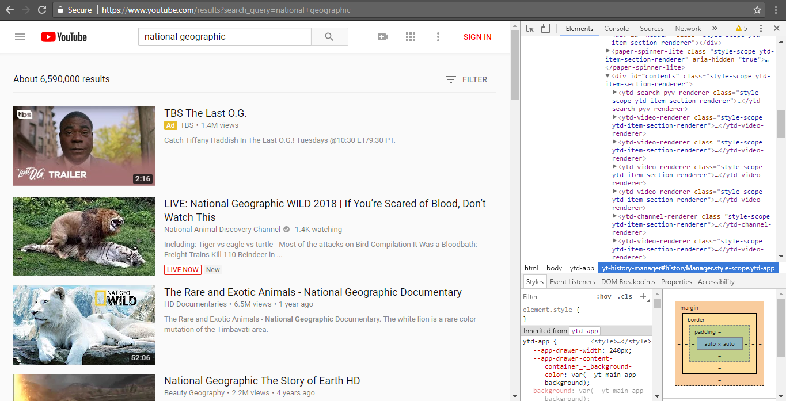

# Entry Six:

In this week, I thought about my minimum viable product (MVP) of what I wanted to make with web scraping. I also learned something that might be useful in the future if I choose to continue web scraping.

## Searching for an Idea

Throughout the last few entries, I was mainly focused on the learning aspect of web scraping. Now that I have learned how to scrape, I decided to finally start thinking about what to make using this skill. After doing a bit of searching, I came across [this site](https://www.quora.com/What-are-some-cool-project-ideas-based-on-Web-scraping) about some project ideas. One of those ideas was a price comparison program. I thought that this would be a cool app to make as it could be very useful for consumers who want the best price on a product. 

In addition, also found [this blog](https://blog.hartleybrody.com/web-scraping/) to be interesting. Specifically, about halfway through the reading, the blog mentions how there will be certain situations where scraping cannot be done. This made me think about looking at the website's terms of service if I want to scrape from that site.

## The `robots.txt` file

After some more googling, I learned about the usefulness of the **`robots.txt`** file. Basically, this is a file that tells web robots what it can and can't do in a website. This file can be seen by adding `/robots.txt` at the end of a site's url. Now, I don't think I am using a robot or a web crawler to scrape my data (at least I hope not), so I don't need to worry about this.

## A (Tentative) Decision

It's a little late, but I finally decided to make my project about scraping YouTube. I think it's legal to scrape from their site, according to their [Terms of Service](https://www.youtube.com/static?template=terms) and googling. At first, I had thought about scraping videos from one specific channel, but I realized I could also scrape YouTube search results and even YouTube's home page. After all, each contains the same divs and classes. After a lot of thinking, I chose to scrape from YouTube's search results because the url is just what the user searches for.

Due to how long I spent on deciding what my MVP would be, I have to start building in the next entry.

## Takeaways

1. *Do not spend too much time just thinking about an idea.* The best thing to do is to start building once you have an idea on what to build. I should've done that instead of just thinking about my MVP.
2. *Make sure what you are doing is legal and read the Terms of Service!* I know that this doesn't apply to most people, but if your project is anything like mine, you're going to need to read the Terms of Service if you are using their website.