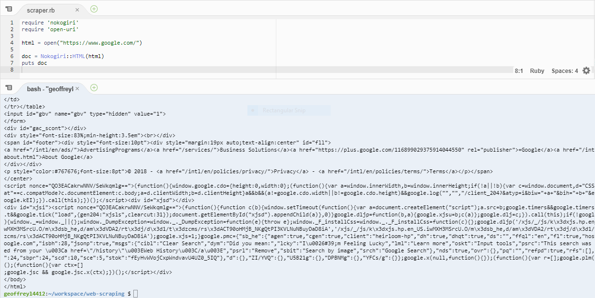

# Entry Two:

In this week, I explored many open source platforms for machine learning. However, I could not find any platforms that were suitable for me. Instead, I chose my second option and learned more about web scraping.

## Realization

While I was exploring machine learning, I realized that while *reading* about the topic is great, I never really thought about **how** I was going to build a working program from scratch. So, I searched up open source platforms for machine learning. I first went into [this article](http://opensourceforu.com/2017/01/best-open-source-machine-learning-frameworks/) and read through each framework. To my surprise, *none* of the frameworks felt suited for me as almost all of them required to download, which did not feel convenient for me. As I continued my search for ways to utilize machine learning, I slowly felt that this topic isn't right for me. **However**, when I stumbled onto [this list](https://github.com/arbox/machine-learning-with-ruby#machine-learning-libraries), I thought my problem was solved. Unfortunately, even though these frameworks used Ruby, reading them was really confusing and complicated. I finally decided that machine learning wasn't for me after all. 

## Web Scraping Transition

When I thought about choosing another topic, I remembered that I have explored a little bit on web scraping. The topic still interests me, and there are resources in the Flatiron school about web scraping. Plus, I can *actually* use it in Ruby. Thus, I switched gears and went on to study web scraping.

Going back to [this reading](https://github.com/learn-co-students/scraping-reading-001), in order to scrape HTML, the Nokogiri gem and open-uri is needed. **Nokogiri** allows the program to parse HTML. **Open-URI** is a Ruby module that takes in a url and returns its HTML.

Continuing on, here is my example of basic web scraping:

* Line 4 grabs the HTML of the website, [Google](https://www.google.com/), and stores that into the variable `html`
* Line 6 uses `Nokogiri::HTML`, a method that takes in a string of HTML, and turns `html` into **nested nodes** (elements where parent elements contain child elements)

## Takeaways

1. Like last week's takeaway, make sure you explore your topic to see if you've made the right decision.
2. Understand the vocabulary and syntax of your topic and define them in your own words. My definition of nested nodes was much simpler than the Flatiron School's explanation so I was able to understand the phrase better.
3. **Plan ahead** This entry was short due to procrastination and I didn't plan on what to accomplish. After this entry, I will plan on my goals for future entries.